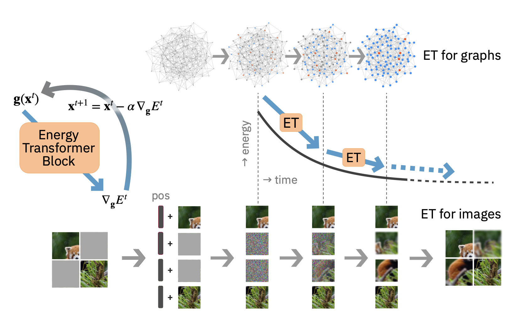

# Energy Transformer For Graph Classification

> A novel Transformer variant that is both an associative memory model and a continuous dynamical system with a tractable energy that is guaranteed to converge to a fixed point. See [our paper](https://arxiv.org/abs/2302.07253) for full details. Also, check out other official implementations of our work, see [ET for Graph Anamoly Detection (PyTorch)](https://github.com/zhuergou/Energy-Transformer-for-Graph-Anomaly-Detection/), [ET for Image (PyTorch)](https://github.com/Lemon-cmd/energy-transformer-torch), and [ET for Image (Jax)](https://github.com/bhoov/energy-transformer-jax).



# Installation
```
pip install -r requirements.txt
pip install --upgrade "jax[cuda]" -f https://storage.googleapis.com/jax-releases/jax_cuda_releases.html
```
Note, it is important to read the official [Jax](https://github.com/google/jax) installation guide to properly enable GPU and for further details.
Additionally, see [Jax Versions](https://storage.googleapis.com/jax-releases/jax_cuda_releases.html) for installing specific Jax-cuda version.

## Test the install by starting python and running the following code to check whether if GPU is enabled for Jax:
```
import jax
print(jax.local_devices())
```

## Setting up data
Fortunately, [PyTorch Geometric](https://pytorch-geometric.readthedocs.io/en/latest/) has provided awesome datasets and dataloaders which will automatically download datasets when code is ran. Simply change the provided dataset name for TUDataset or GNNBenchmark.
```
model_name = data_name = 'CIFAR10'
train_data = GNNBenchmarkDataset(root = '../data/', name = data_name, split = 'train')
```

## See if it works
Simply, navigate to the ***nbs*** folder for the provided [Jupyter](https://jupyter.org) notebooks to run the experiments.
```
./run_nb_inplace nbs/eval_cifar10.ipynb
```
## Training from scratch
Since there are a number of provided pretrained models, please ensure that such files are **removed** or **stored** in a different folder such that they won't be reloaded.
```
./run_nb_inplace nbs/cifar10.ipynb
```

## Pretrained Models
Some pretrained models are provided in the ***saved\_models*** folder. To download the rest of the pretrained models, see [Google Drive Link](https://drive.google.com/drive/folders/1LGydNfJfnlVajFV_KCJ9mRsnFCUKh9zs?usp=share_link). 

## Citation
if you find the code or the work useful, please cite our work!

```
@article{hoover2023energy,
  title={Energy Transformer},
  author={Hoover, Benjamin and Liang, Yuchen and Pham, Bao and Panda, Rameswar and Strobelt, Hendrik and Chau, Duen Horng and Zaki, Mohammed J and Krotov, Dmitry},
  journal={arXiv preprint arXiv:2302.07253},
  year={2023}
}
```
